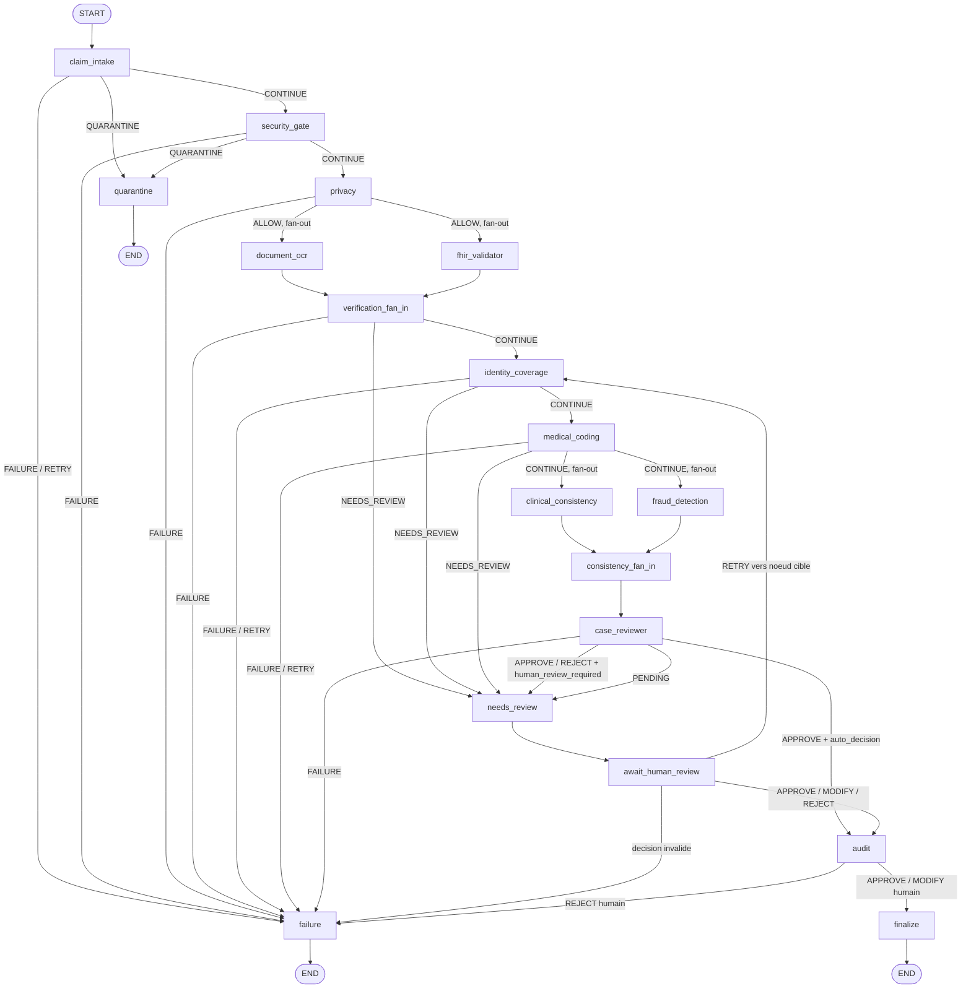

# Audit technique — ClaimShield Santé

**Date de l'audit :** 2026-07-09
**Périmètre :** dépôt `claimshield-sante` (branche `main`, working tree courant, y compris les modifications non commitées visibles via `git status`)
**Commanditaire :** AZIZ Douagi (stagiaire Wevioo)
**Nature :** audit lecture seule — aucune modification de code effectuée dans le cadre de cette mission.

---

## 0. Addendum post-audit (2026-07-09, plus tard le même jour)

Postérieurement à la rédaction de ce rapport, un test réel du pipeline avec Ollama a révélé un point de performance qu'aucune section de cet audit n'avait identifié — cohérent avec la limite explicite déclarée en §2 (« aucune mesure de performance en charge » dans le périmètre de cette mission) : `Orchestrator._persist_audit_events` (`orchestrator/executor.py`) normalisait chaque `AuditEvent` d'un nœud via **un appel LLM par événement** (3 à 9 événements par nœud), en plus de l'appel LLM de décision propre à l'agent — un nœud pouvait prendre ~110-140s à s'exécuter, soit ~8-12 minutes pour qu'une soumission réelle atteigne `needs_review`.

**Correctif implémenté (option choisie par AZIZ) : normalisation d'audit batchée par nœud** — un seul appel LLM normalise désormais tous les événements d'audit d'un nœud à la fois, plutôt qu'un appel par événement. Chemin entièrement additif : le mécanisme single-event (`agents/audit_agent/agent.py::normalize_event`/`_invoke_llm_audit`) reste inchangé ligne par ligne et continue de servir `security_gate_agent`/`human_review/service.py` (qui n'appellent jamais le normalizer en lot). Le nouveau chemin (`_invoke_llm_audit_batch`/`normalize_events_batch`, `agents/audit_agent/agent.py`) est câblé par défaut dans `graph/nodes.py::build_orchestrator()` via `Orchestrator.audit_batch_normalizer` (nouveau champ, prioritaire sur `audit_normalizer`).

**Garanties de conformité vérifiées comme préservées** (mêmes propriétés que celles saluées en §5.3 pour le chemin single-event, désormais valables aussi pour le chemin batché) :
- Réassociation par **index explicite**, jamais par position dans la réponse (`LlmAuditNormalizedEventBatch`, schéma `agents/audit_agent/schemas.py`) — un index absent, dupliqué (les deux occurrences invalidées) ou hors bornes déclenche un repli individuel ciblé sur le chemin single-event existant, jamais un choix arbitraire.
- La réponse du normalizer est explicitement réalignée sur `len(events)` éléments avant toute persistance (`orchestrator/executor.py::_persist_audit_events_batched`) — jamais un `zip(events, normalized_list)` direct, qui tronquerait silencieusement une réponse trop courte ; chaque événement sans normalisation correspondante reste individuellement journalisé (`orchestrator_audit_not_persisted`) et **jamais persisté**, à l'identique du comportement single-event déjà audité en §5.3.
- Rédaction (`redact_audit_payload`) et plancher de rédaction (`_REDACTION_RANK`) appliqués indépendamment par événement du lot — jamais partagés entre événements, même partageant `case_id`/`actor` (test dédié anti-mélange, `tests/audit/test_agent.py::TestInvokeLlmAuditBatchNeverMixesSameCaseIdOrActor`).

**Ce que ce correctif ne change pas** : les constats de persistance en mémoire du §6.1 (`AuditStore` toujours sans backend disque câblé en production) restent entièrement valides — ce correctif réduit le nombre d'appels LLM nécessaires à la normalisation, il ne touche ni au caractère en mémoire du store ni à `database/audit_models.py` (toujours non câblé).

**Tests et qualité** : 25 tests dans `tests/audit/test_agent.py` (contre 11 fonctions avant, dont 14 nouvelles dédiées au chemin batché), 31 tests dans `tests/orchestrator/test_executor.py` (contre 27, 4 nouveaux dans `TestAuditStoreBatchPersistence`) — suite complète repassée : **3203 tests collectés, 3202 passés, 1 sauté, 0 échec** ; `ruff check .` toujours limité aux 13 erreurs `E402` pré-existantes de `scripts/run_agent_manual.py` (inchangé, hors périmètre). Le gain de performance réel n'a volontairement pas été chiffré dans le code ni ici tant qu'une mesure réelle avec Ollama ne l'a pas confirmé — voir `orchestrator/README.md` (section « Normalisation d'audit batchée (option C d'AZIZ) ») et `CLAUDE.md` pour le détail complet du mécanisme.

Les tableaux du §8.1 et le total de tests cités dans le corps de ce rapport ont été mis à jour en conséquence ; le reste du rapport (sections 1 à 10, hors ce préambule) reflète toujours fidèlement l'état du code **au moment de l'audit initial**, avant ce correctif.

---

## 1. Résumé exécutif

ClaimShield Santé est un système multi-agents LangGraph (11 agents métier + 7 nœuds techniques, 18 nœuds au total) de traitement de sinistres santé, en fin d'implémentation (~step 13-14/18 selon la feuille de route interne, avec en réalité 4 phases de remédiation supplémentaires déjà terminées au-delà). Le socle est solide : 3203 tests collectés sans erreur (3202 passés, 1 sauté — voir addendum §0), `ruff check .` ne remonte que 13 erreurs de style toutes concentrées dans un seul script CLI hors périmètre applicatif, et le garde-fou critique demandé — **aucun rejet (`REJECT`) ne peut jamais être finalisé de façon autonome sans revue humaine** — est vérifié à la fois par la logique de routage (`graph/edges.py`) et verrouillé structurellement au niveau du schéma Pydantic (`schemas/results.py`), ce qui rend ce garde-fou robuste même face à une implémentation d'agent défaillante ou malveillante.

Le point d'attention majeur de cet audit est la **persistance**. Deux mécanismes présentés dans la documentation interne comme des piliers de traçabilité et anti-fraude — le journal d'audit (`AuditStore`) et l'index de détection de doublons (`DuplicateIndex`) — sont **entièrement en mémoire process**, sans écriture disque ni base de données réelle. Un module SQLAlchemy existe (`database/audit_models.py`) mais n'est câblé nulle part dans le code de production : c'est un chemin de persistance mort, exercé uniquement par son propre test unitaire. Concrètement, tout redémarrage de conteneur ou tout scaling horizontal fait perdre l'historique d'audit et l'historique de doublons déjà indexés. C'est acceptable pour une démo/MVP mono-instance mais bloquant pour une mise en production réelle avec redémarrages et haute disponibilité.

Second point notable : contrairement aux 10 autres agents, `claim_intake_agent` laisse au LLM une autorité *non bornée* sur le statut final d'ingestion, sans le garde-fou monotone (« le LLM ne peut qu'escalader, jamais assouplir ») appliqué partout ailleurs dans le pipeline — une incohérence de conception à trancher explicitement plutôt qu'une découverte accidentelle.

Rien dans cet audit ne remet en cause la sous-partie HITL (step 13), traitée uniquement en inventaire, conformément à la consigne de protection de cette partie déjà validée.

---

## 2. Méthodologie et limites de l'audit

- **Lecture seule stricte.** Aucune modification de fichier applicatif à aucun moment de cette mission. La seule commande à effet observable a été `ruff check .` (analyse statique, ne modifie rien).
- **Basé sur l'inspection du code réel, pas sur la documentation seule.** Le fichier `CLAUDE.md` du dépôt contient une documentation interne très détaillée de l'avancement du projet ; il a servi de carte de départ pour orienter l'exploration, mais **chaque affirmation reprise ci-dessous a été vérifiée par lecture directe du code source**, via trois explorations en parallèle (agents & routage du graphe ; base de données & persistance ; tests/qualité/Docker/observabilité), puis une contre-vérification manuelle supplémentaire sur les six points les plus sensibles (verrous `CaseReviewerResult`, `route_review`/`route_after_audit`, `AuditStore.append_event`, docstring `DuplicateIndex`, non-usage de `database/audit_models.py`, autorité LLM de `claim_intake_agent`) — toutes confirmées exactes.
- **Citations `fichier:ligne` systématiques.** Chaque constat factuel de ce rapport est accompagné d'une référence précise ; un constat non vérifiable par une citation n'est pas inclus.
- **Format des constats.** Chaque point d'attention des sections 4 à 8 suit une structure fixe en quatre temps : *Constat vérifié* → *Impact technique* → *Niveau de risque* → *Recommandation*. Pour les deux constats de persistance en mémoire (`AuditStore`, `DuplicateIndex`), le niveau de risque est volontairement nuancé en **« bloquant pour une mise en production / majeur pour un MVP ou une démo »**, plutôt qu'une étiquette unique, car la sévérité réelle dépend entièrement du contexte de déploiement visé.
- **Limites explicites** : cet audit ne comprend aucune exécution de bout en bout du système (pas de lancement réel d'Ollama/API/UI dans le cadre de cette mission), aucune mesure de performance en charge, et reflète l'état du code au moment de l'exploration (working tree courant, modifications non commitées incluses). Le sous-système HITL (step 13, ~145 tests dédiés + tests de routage associés) n'a été traité qu'en inventaire factuel (fichiers existants, tests existants) — il n'a fait l'objet d'aucune remise en question ni d'aucune proposition de modification, conformément à la consigne de protection reçue.

---

## 3. Vue d'ensemble de l'architecture

### 3.1 Diagramme du graphe LangGraph (18 nœuds)



*Note de lecture :* la flèche `RETRY vers noeud cible` est simplifiée ici sur `identity_coverage` à titre d'illustration — en réalité la cible est dynamique, choisie parmi 10 nœuds relançables (`RELAUNCH_TARGETS`, `graph/edges.py:70-94`), sous réserve que ce nœud ait déjà produit un résultat pour le dossier (`RELAUNCH_RESULT_FIELDS`, `graph/edges.py:96-116`) et que `correction_attempts` n'ait pas dépassé la limite configurée.

### 3.2 Tableau des 11 agents métier

| Agent | Pattern LLM | Autorité réelle du LLM sur le statut/décision finale |
|---|---|---|
| `claim_intake_agent` | `with_structured_output` | **Non bornée** — le statut LLM écrase le statut déterministe sans garde-fou monotone (voir §5.2) |
| `security_gate_agent` | `with_structured_output` | Bornée — peut seulement escalader (ALLOW→QUARANTINE→BLOCK), jamais désescalader |
| `privacy_agent` | `with_structured_output` | Aucune — statut 100% déterministe (RBAC/pseudonymisation), LLM = justification d'audit uniquement |
| `document_ocr_agent` | ReAct | Bornée — ne peut proposer `doc_type` que si non-UNKNOWN, champs extraits acceptés seulement si trouvés verbatim dans le texte source |
| `fhir_validator_agent` | ReAct | Bornée/monotone — ne peut jamais assouplir un `FAIL` déterministe, ne peut qu'escalader un `NEEDS_REVIEW` |
| `identity_coverage_agent` | ReAct | Aucune — statuts 100% déterministes, LLM = motifs/avertissements uniquement |
| `medical_coding_agent` | ReAct | Bornée — code accepté uniquement s'il existe dans le référentiel local, jamais un `PASS` automatique sur simple correspondance floue |
| `clinical_consistency_agent` | ReAct | Bornée — ajustement de sévérité d'un cran maximum, statut final toujours recalculé déterministiquement |
| `fraud_detection_agent` | ReAct | Bornée — pondération ajustée par facteur fixe (0.5/1.0/1.5), statut recalculé par seuils fixes |
| `case_reviewer_agent` | `with_structured_output` | Bornée et verrouillée par schéma — `status`/`human_review_required` ne peuvent jamais sortir de `NEEDS_REVIEW`/`True` |
| `audit_agent` | `with_structured_output` | Bornée — normalise le contenu de l'événement, mais ne décide jamais *si* l'événement est persisté ni le niveau de rédaction (plancher déterministe) |

### 3.3 Parallélisme vs séquentiel

- **Deux fan-out réels** (exécution simultanée dans le même superstep LangGraph) : `document_ocr` / `fhir_validator` après `privacy` (`graph/edges.py:236-252`), et `clinical_consistency` / `fraud_detection` après `medical_coding` (`graph/edges.py:313-328`).
- **Deux nœuds de convergence purs** (aucune logique métier, marqueurs de synchronisation) : `verification_fan_in` et `consistency_fan_in` (`graph/technical_nodes.py:129-139`).
- **Chemin strictement séquentiel, par choix de conception explicite** : `claim_intake → security_gate → privacy` (avant le premier fan-out), `identity_coverage → medical_coding` (entre les deux fan-out), et surtout `case_reviewer → (needs_review/await_human_review) → audit → finalize`, documenté comme n'ayant plus aucun gain de parallélisme identifiable (`graph/workflow.py`, commentaire de conception) — chaque étape a besoin de l'état complet produit par la précédente.

---

## 4. Fonctionnalités — implémenté vs prévu

| Domaine | Statut | Fichiers |
|---|---|---|
| Ingestion, sécurité, confidentialité, OCR, FHIR, identité/couverture, codification, cohérence clinique, fraude, synthèse HITL, audit (11 agents) | **Implémenté** — tous appellent un LLM réel, plus aucun stub | `agents/*/agent.py` |
| Orchestrateur (contrats, registre de modèles, politiques, routage, exécuteur) | **Implémenté**, câblé en production | `orchestrator/` |
| Graphe LangGraph (18 nœuds, parallélisation, HITL) | **Implémenté** | `graph/` |
| API FastAPI (4 endpoints) | **Implémenté** | `api/main.py`, `api/schemas.py` |
| UI Chainlit (client HTTP pur de l'API) | **Implémenté** | `ui/` |
| Packaging Docker (image unique, 2 services) | **Implémenté** | `Dockerfile`, `docker-compose.yml` |
| Observabilité structlog | **Implémenté**, migration quasi complète | `config/logging.py` |
| Persistance SQLAlchemy de l'audit | **Stub non câblé** — voir §5.3 | `database/audit_models.py` |
| `app/` (point d'entrée applicatif générique) | **Vide** — rôle repris par `ui/` | — |
| `mcp_servers/` | **Vide**, reporté par décision produit (post-démo) | — |

**Constat vérifié :** aucun agent métier ne reste un stub — confirmé par grep exhaustif effectué pendant l'exploration (aucun `_NotImplementedStub` actif hors `agents/case_reviewer_agent`/`agents/audit_agent`, eux-mêmes réellement implémentés).
**Impact technique :** le périmètre fonctionnel « traitement de bout en bout d'un dossier » est complet ; les manques résiduels sont des choix de portée assumés (MCP) ou des scaffoldings inertes (persistance SQLAlchemy).
**Niveau de risque :** mineur.
**Recommandation :** documenter explicitement, dans le rapport de stage, que `app/`/`mcp_servers/` sont des dossiers planifiés volontairement vides plutôt que des manques non anticipés.

---

## 5. Agents — autonomie, prompts, communication de décision

### 5.1 Vérification critique — aucun REJECT autonome sans revue humaine

**Constat vérifié :** `schemas/results.py:1329-1348` définit deux `field_validator` sur `CaseReviewerResult` :
```python
@field_validator("status")
def _status_locked_to_needs_review(cls, v):
    if v is not VerificationStatus.NEEDS_REVIEW:
        raise ValueError(...)
    return v

@field_validator("human_review_required")
def _human_review_locked_to_true(cls, v):
    if not v:
        raise ValueError(...)
    return v
```
Il est donc **structurellement impossible** de construire une instance valide de `CaseReviewerResult` où `status` ou `human_review_required` s'écarteraient de `NEEDS_REVIEW`/`True` — ce n'est pas une convention respectée par le code appelant, c'est une garantie du type lui-même. `graph/edges.py:428-493` (`route_review`) documente explicitement (commentaire lignes 451-459) que les branches défensives historiques (`human_review_required=False → END`) sont devenues du code mort accessible seulement à un objet non validé par le schéma (mock de test), jamais à une instance réelle produite par l'agent. Le seul raccourci autonome existant, `AUTO_APPROVED_LOW_RISK` (P1-4, `agents/case_reviewer_agent/agent.py`, fonction `_auto_decision_eligibility`), est réservé exclusivement à `APPROVE` (jamais `REJECT`, edges.py:472-473) et route quand même vers `audit` avant `finalize` (`graph/edges.py:486-487`, `graph/workflow.py:602-610`) — il ne contourne jamais la traçabilité, seulement l'attente humaine bloquante.

**Impact technique :** même une implémentation d'agent bugguée, ou un futur développeur modifiant `case_reviewer_agent` par erreur, ne peut pas produire un rejet auto-finalisé — le verrou est au niveau du type Pydantic, indépendant du code applicatif qui l'entoure.
**Niveau de risque :** aucun — ceci est une confirmation positive, pas un point d'attention.
**Recommandation :** aucune action requise ; ce mécanisme peut être cité tel quel comme preuve de robustesse dans le rapport de stage.

### 5.2 Incohérence — autorité LLM non bornée dans `claim_intake_agent`

**Constat vérifié :** `agents/claim_intake_agent/agent.py:556-579` (`_finalize_with_llm`) :
```python
final_status = llm_status_map.get(llm_decision.status, manifest.status)
```
Le statut proposé par le LLM (`ACCEPTED`/`QUARANTINED`/`BLOCKED`/`ERROR`) remplace directement `final_status`, **sans comparaison avec le statut déterministe de la Phase A** (le manifeste calculé par inspection de fichiers). C'est le seul agent du pipeline où ce garde-fou est absent : `security_gate_agent` n'autorise que l'escalade (`_DECISION_RANK`, agent.py:140-142 et 717-730) ; `fhir_validator_agent` est monotone (ne peut jamais assouplir un `FAIL`) ; `medical_coding_agent`/`fraud_detection_agent`/`clinical_consistency_agent` recalculent toujours le statut final par une fonction déterministe après un ajustement borné du LLM.

**Impact technique :** ce statut (`intake_status`) alimente directement `route_intake` (`graph/edges.py:155-186`), qui décide CONTINUE/QUARANTINE/FAILURE/RETRY — une hallucination ou une réponse LLM erronée pourrait donc, en théorie, transformer un dossier déterministiquement `BLOCKED` (ex. fichier dangereux détecté) en `ACCEPTED`, ou l'inverse. Ce risque est partiellement atténué en amont par les scans de sécurité de la Phase A (qui restent déterministes et alimentent le contexte transmis au LLM), mais l'agent n'impose aucune borne finale.
**Niveau de risque :** majeur.
**Recommandation :** aligner `claim_intake_agent` sur le pattern déjà utilisé par `security_gate_agent`/`fhir_validator_agent` — n'autoriser le LLM qu'à escalader la sévérité (jamais assouplir un `BLOCKED`/`QUARANTINED` déterministe vers `ACCEPTED`), par un recalcul de rang similaire à `_DECISION_RANK`.

### 5.3 Découplage LLM/persistance de l'Audit Agent — confirmé sain

**Constat vérifié :** dans `agents/audit_agent/agent.py`, la décision *de persister* un événement n'est jamais conditionnée par un jugement du LLM — `AuditAgent.run` tente toujours la persistance, soit via le chemin normal (`self.audit_store.record_event(...)`) quand la normalisation LLM réussit, soit via `_record_degraded_fallback` (agent.py:199-286) quand elle échoue, qui persiste un événement `ANOMALY` déterministe (`event_type`, `redaction_status`, `outcome` tous calculés sans appel LLM). Le seul cas où un événement n'est réellement pas persisté est une panne structurelle du store lui-même (`AuditStoreError`), jamais un choix du LLM. De plus, le `redaction_status` proposé par le LLM ne peut jamais être *assoupli* en dessous du plancher calculé déterministiquement par `redact_audit_payload` (`agent.py:119-120`, comparaison de rang `_REDACTION_RANK`). Le chaînage cryptographique (`compute_event_hash`/`build_audit_event`, `schemas/audit.py:222-241`) est 100% déterministe (SHA-256 du contenu canonique JSON), et `AuditStore.append_event` (`services/audit_store.py:174-219`) revérifie indépendamment l'intégrité de la chaîne avant tout stockage.
**Impact technique :** le journal d'audit reste fiable et non contournable même si le LLM de normalisation dérive ou échoue — sa seule fragilité réelle est la persistance en mémoire (voir §6.1), pas le mécanisme de décision.
**Niveau de risque :** aucun sur ce point précis — confirmation positive.
**Recommandation :** aucune action requise sur le découplage lui-même ; voir §6.1 pour la persistance physique.

*Mise à jour post-audit (voir §0) :* un second chemin de normalisation, batché (`Orchestrator.audit_batch_normalizer`, `orchestrator/executor.py`), a été introduit après cet audit pour réduire le nombre d'appels LLM par nœud. Les garanties décrites ci-dessus (persistance jamais conditionnée à un jugement du LLM, plancher de rédaction non contournable, chaînage SHA-256 indépendant) ont été vérifiées comme préservées à l'identique sur ce nouveau chemin — voir §0 pour le détail.

### 5.4 Garde dossier vide (`EMPTY_CLAIM`) — confirmé actif

**Constat vérifié :** `agents/claim_intake_agent/agent.py:140-152` (répertoire `source_path` absent) et `agents/claim_intake_agent/agent.py:159-171` (répertoire présent mais vide) routent tous deux vers `_finalize_without_llm` (agent.py:472-505), qui ne contacte jamais le LLM — contrairement au cas `TOO_MANY_FILES` (agent.py:173-192), qui passe par `_finalize_with_llm` normal. Le commentaire de code (agent.py:128-138) documente explicitement cette exception comme la seule dérogation à la règle « LLM appelé à chaque exécution effective ».
**Impact technique :** évite des appels Ollama inutiles sur des dossiers structurellement vides, sans dégrader la sûreté (décision `BLOCKED` toujours déterministe et non ambiguë dans ce cas).
**Niveau de risque :** aucun — confirmation positive, garde toujours actif.
**Recommandation :** aucune action requise.

### 5.5 Logs silencieux sur échec LLM — 11 occurrences

**Constat vérifié :** les 11 agents partagent le même motif dans leur fonction `_invoke_llm_*` :
```python
except Exception:
    return None
```
sans aucun appel `logger.*` avant le `return`. Occurrences confirmées : `claim_intake_agent/agent.py:91`, `clinical_consistency_agent/agent.py:463`, `document_ocr_agent/agent.py:704`, `fhir_validator_agent/agent.py:314`, `fraud_detection_agent/agent.py:511`, `identity_coverage_agent/agent.py:535`, `medical_coding_agent/agent.py:99`, `privacy_agent/agent.py:81`, `security_gate_agent/agent.py:386`, `case_reviewer_agent/agent.py:431`, `audit_agent/agent.py:122`.
**Impact technique :** fonctionnellement sûr (le fallback déterministe/fail-closed s'applique correctement dans tous les cas déjà vérifiés au §5.1-5.4), mais **opérationnellement aveugle** : impossible de distinguer en production « le LLM a été appelé et a confirmé le résultat déterministe » de « l'appel LLM a échoué silencieusement » (timeout Ollama, JSON malformé, erreur de validation Pydantic) sans consulter directement `errors`/`reasons` dossier par dossier.
**Niveau de risque :** mineur.
**Recommandation :** ajouter un `logger.warning("agent_llm_call_failed", agent=..., case_id=..., exc_info=True)` avant chaque `return None`, en réutilisant `config.logging.get_logger` déjà en place pour les autres logs structurés du projet.

---

## 6. Bases de données et persistance

### 6.1 `AuditStore` — journal d'audit entièrement en mémoire

**Constat vérifié :** `services/audit_store.py:165-167` initialise `self._events_by_case: dict[str, list[AuditEvent]]` — aucune E/S disque ou réseau dans toute la classe. Le module docstring l'assume explicitement : « Persistance en mémoire uniquement pour la durée de vie de l'objet ». Un module de persistance SQLAlchemy existe bel et bien (`database/audit_models.py`, table `audit_events`, fonction `init_db()`), mais un grep dédié sur l'ensemble du dépôt confirme qu'il **n'est importé nulle part en production** :
```
ui/app.py:22      → un commentaire qui *mentionne* le module, ne l'importe pas
tests/audit/test_models.py:18,74 → seul import réel, dans le test unitaire du module lui-même
```
Aucune occurrence dans `api/`, `graph/`, `orchestrator/`, `agents/`, `human_review/`. Partout où un `AuditStore` est nécessaire en production (`agents/audit_agent/agent.py`, `graph/nodes.py::build_orchestrator()`, `orchestrator/executor.py`, `agents/security_gate_agent/agent.py`), il est instancié à neuf (`AuditStore()`) sans jamais passer par `database.audit_models`.
**Impact technique :** tout le journal d'audit chaîné (traçabilité réglementaire, preuve d'intégrité SHA-256) vit uniquement dans la mémoire du process API. Un redémarrage de conteneur, un déploiement, un crash, ou simplement plusieurs workers API en parallèle (chacun avec son propre `AuditStore` indépendant) font perdre ou fragmentent silencieusement l'historique d'audit — sans erreur visible, puisque `AuditStore()` redémarre toujours avec un journal vide et valide.
**Niveau de risque :** **bloquant pour une mise en production** (l'audit réglementaire doit survivre à un redémarrage) / **majeur pour un MVP ou une démo mono-instance** (fonctionnellement correct tant que le process ne redémarre pas).
**Recommandation :** décider explicitement du sort de `database/audit_models.py` — soit le câbler réellement (`AuditStore` gagnerait une option de synchronisation vers `AuditEventRow` à chaque `record_event`, ou serait remplacé par un store adossé à la table), soit le documenter comme prototype non retenu et le retirer pour éviter l'impression trompeuse d'une persistance déjà fonctionnelle.

### 6.2 `DuplicateIndex` — historique de fraude entièrement en mémoire

**Constat vérifié :** `services/duplicate_index.py:1-24` (docstring de module) : « l'index vit en mémoire pour la durée de vie de l'objet ; la persistance (base de données, voir `database/`, toujours un stub) est hors périmètre de ce module ». Une instance partagée par défaut existe (`agents/fraud_detection_agent/tools.py::_DEFAULT_DUPLICATE_INDEX`, niveau module), explicitement documentée comme volontaire (« visible et injectable, jamais un singleton caché ») mais qui reste, par construction, propre à chaque process Python.
**Impact technique :** la détection de doublons/quasi-doublons (signal anti-fraude `EXACT_DUPLICATE_INVOICE`/`NEAR_DUPLICATE_INVOICE`) perd tout son historique à chaque redémarrage, et surtout **chaque worker API indépendant a sa propre vue partielle** de l'historique en cas de scaling horizontal (plusieurs processus derrière un load-balancer) — un doublon soumis sur deux workers différents ne serait jamais détecté comme tel.
**Niveau de risque :** **bloquant pour une mise en production** (la détection de doublons doit être globale et durable pour avoir une valeur anti-fraude réelle) / **majeur pour un MVP ou une démo mono-instance/mono-process**.
**Recommandation :** adosser `DuplicateIndex` à un store partagé (table SQL avec index sur `document_hash`/`patient_pseudonym`, ou cache partagé type Redis) avant tout déploiement multi-instance ou avec redémarrages fréquents.

### 6.3 Backend de checkpoint LangGraph (`ClaimState`)

**Constat vérifié :** `graph/checkpoints.py` supporte 3 backends (`CheckpointBackend`: `MEMORY`/`SQLITE`/`POSTGRES`). Le défaut applicatif (`config/settings.py`, `langgraph_checkpoint_backend = "memory"`) est `memory` — sans configuration explicite, **aucune persistance de `ClaimState` n'existe**, y compris pour les dossiers en attente de revue humaine (HITL). Le backend `sqlite` est réellement fonctionnel (construction directe via `sqlite3.connect(...)`, contournant délibérément le bug de context manager de `SqliteSaver.from_conn_string`, documenté et testé — `tests/unit/test_checkpoints.py::TestSqliteBackend`). Le backend `postgres` est un **stub non installable en l'état** : `langgraph-checkpoint-postgres` n'apparaît ni dans `requirements.txt` ni dans `pyproject.toml` — toute tentative lèverait un `RuntimeError` explicite à l'exécution.
**Impact technique :** la configuration Docker Compose actuelle bascule correctement sur `sqlite` (voir §8.3), ce qui couvre le besoin HITL en conteneur unique ; mais l'absence de dépendance Postgres signifie qu'aucun déploiement multi-instance à haute disponibilité n'est possible aujourd'hui sans travail d'intégration supplémentaire.
**Niveau de risque :** mineur pour l'usage actuel (le défaut `sqlite` est bien appliqué en Docker) / majeur si un déploiement Postgres était supposé disponible sans travail additionnel.
**Recommandation :** soit ajouter `langgraph-checkpoint-postgres` aux dépendances et vérifier le chemin `POSTGRES` par un test dédié (aucun test actuel ne l'exerce), soit documenter clairement que Postgres est aspirationnel/non prêt.

### 6.4 État partagé `ClaimState` — schéma complet

**Constat vérifié :** `state/claim_state.py` définit un `TypedDict(total=False)` avec 5 champs à réducteur append-only (`Annotated[list, operator.add]`) — `completed_steps`, `errors`, `alerts`, `audit_trail`, `final_justification` — et tous les autres champs (un par agent : `intake_result`, `security_result`, …, `review_result`, `audit_result`, plus les champs d'entrée consommés `*_input` et les champs de contrôle `case_id`/`current_step`/`human_decision`/`correction_attempts`/`final_recommendation`) en simple écrasement (LastValue). Aucune persistance ligne-par-ligne de `ClaimState` n'existe en dehors des checkpoints LangGraph (§6.3) — ce `TypedDict` n'est pas une « base de données » au sens propre, seulement un état partagé transitoire entre nœuds d'une même exécution.
**Impact technique :** cohérent avec un usage LangGraph standard ; les garde-fous de validation (`validate_state_update`/`validate_claim_state`, `state/claim_state.py`) empêchent la fuite de données non minimisées (texte OCR complet, chemins absolus, secrets) dans cet état avant tout checkpoint.
**Niveau de risque :** aucun — architecture conforme aux pratiques LangGraph standard.
**Recommandation :** aucune action requise.

### 6.5 Référentiel médical et absence de table SQL

**Constat vérifié :** `config/rules/medical_codes.yaml` contient 47 entrées (32 SNOMED-CT, 15 RxNorm), explicitement déclarées synthétiques dans le fichier lui-même (« Référentiel synthétique versionné... Fondé sur les 6 dossiers de démonstration Synthea »). Chargé en mémoire au runtime par `tools/rule_loader.load_rules`, aucune table SQL ne le sauvegarde. `tools/medical_coding.py::find_fuzzy_candidates`/`lookup_code` opèrent en 4 étapes purement déterministes (exact match → fuzzy candidates ≥ seuil 0.80 → keyword match → non déterminé), sans jamais assigner un code automatiquement sur simple similarité floue.
**Impact technique :** cohérent avec le statut assumé de démonstration (données synthétiques) ; passage à un vrai référentiel CCAM/SNOMED sous licence nécessiterait un travail d'acquisition de données hors périmètre technique de cet audit.
**Niveau de risque :** mineur (attendu et documenté comme tel dans le projet).
**Recommandation :** si une mise en production réelle est envisagée, prévoir l'acquisition d'un référentiel médical sous licence et son chargement (le mécanisme de chargement YAML → mémoire resterait probablement réutilisable tel quel, seul le contenu changerait).

### 6.6 Un seul chemin d'écriture SQL dans tout le projet

**Constat vérifié :** un grep exhaustif de `sqlalchemy`/`asyncpg`/`aiosqlite`/`session.commit()` sur l'ensemble du dépôt (hors `.venv`) ne remonte qu'un seul module applicatif avec une vraie logique de transaction : `database/audit_models.py`, exercé uniquement par `tests/audit/test_models.py`. Aucun autre module (`api/`, `graph/`, `orchestrator/`, `agents/`, `human_review/`, `services/`, `ui/`) n'ouvre de session SQLAlchemy ni n'écrit dans une base SQL.
**Impact technique :** confirme que « base de données » n'existe aujourd'hui, dans les faits, que sous forme de checkpoints LangGraph SQLite (état de dossier) — aucune autre donnée métier (audit, doublons, référentiel) n'est persistée dans un SGBD réel.
**Niveau de risque :** synthèse des points 6.1/6.2/6.3 ci-dessus — voir ces sections pour le détail.
**Recommandation :** voir §6.1/6.2.

---

## 7. Communication inter-agents

### 7.1 Forme du state partagé et points de synchronisation

**Constat vérifié :** voir §6.4 pour le détail des champs de `ClaimState`. Les deux points de synchronisation obligatoires (`verification_fan_in`, `consistency_fan_in`, `graph/technical_nodes.py:129-139`) garantissent — via la sémantique native de superstep LangGraph, pas par un compteur d'arêtes entrantes — que les deux branches d'un fan-out sont toujours terminées avant que le nœud suivant ne s'exécute. Un bug de canal a été découvert et corrigé pendant l'implémentation de la parallélisation (le champ `current_step`, à canal `LastValue`, ne peut recevoir qu'une seule écriture par superstep ; deux branches parallèles qui écrivent chacune leur propre nom lèveraient une erreur) — la solution retenue (`_without_current_step`, enveloppe les 4 nœuds fanned-out) est documentée et testée (`tests/graph/test_workflow_parallel_fan_out.py`).
**Impact technique :** design correct et déjà robustifié contre un bug réel de LangGraph rencontré en cours de développement.
**Niveau de risque :** aucun.
**Recommandation :** aucune action requise.

### 7.2 Gestion d'erreurs et propagation

**Constat vérifié :** voir §5.5 pour le motif silencieux répété dans les 11 `_invoke_llm_*`. En dehors de ce motif spécifique et documenté (fallback intentionnel), les erreurs d'exécution de nœud sont gérées de façon structurée par `Orchestrator.execute_agent` (`orchestrator/executor.py`) : toute exception de l'agent est enveloppée en `AGENT_EXECUTION_FAILED` (jamais propagée telle quelle), avec une politique de retry configurable qui ne rejoue que les pannes réellement transitoires (`httpx.ConnectError`, `httpx.TimeoutException`, `ConnectionError`) ou les sorties structurées réparables — jamais un refus de permission ou une précondition non satisfaite.
**Impact technique :** bonne séparation entre erreurs transitoires (rejouées) et erreurs de permission/précondition (jamais rejouées) — limite le risque de boucles de retry sur des refus d'autorisation.
**Niveau de risque :** mineur (uniquement le sous-point §5.5 sur l'absence de logs).
**Recommandation :** voir §5.5.

### 7.3 Observabilité

**Constat vérifié :** `config/logging.py` configure `structlog` routé à travers `logging` stdlib (`structlog.stdlib.LoggerFactory`), avec bascule JSON (production) / console lisible (développement, `CLAIMSHIELD_DEBUG=true`), et liaison de contexte par dossier (`bind_case_context`/`clear_case_context`, contextvars). Un grep confirme que la migration vers ce module est complète pour tout le code applicatif — seul `scripts/import_synthea_claimshield_cases.py` (script d'import ponctuel, hors runtime API/agents) utilise encore `logging.getLogger` directement.
**Impact technique :** observabilité cohérente et centralisée pour l'ensemble du runtime ; les seuls angles morts identifiés sont le motif silencieux du §5.5 et l'absence de tout dashboard/alerting externe (hors périmètre de ce dépôt — non observé, non attendu).
**Niveau de risque :** mineur.
**Recommandation :** voir §5.5 pour l'action concrète ; envisager d'exposer les logs JSON vers un pipeline d'agrégation (ELK/Loki) lors du passage en production, en dehors du périmètre de ce dépôt.

---

## 8. Qualité générale du code

### 8.1 Couverture de tests

**Constat vérifié :** 3203 tests collectés (3202 passés, 1 sauté), 0 erreur de collection (`pytest --collect-only -q tests/`) — chiffres mis à jour post-addendum §0 (audit initial : 3185). Répartition par package (fonctions `def test_`, hors instances paramétrées) :

| Package | Fichiers | Tests (approx.) | Couvre |
|---|---|---|---|
| `tests/agents` | 22 | ~982 | Logique métier des 11 agents + fusion des décisions LLM |
| `tests/graph` | 16 | ~483 | Nœuds, arêtes, nœuds techniques, checkpoints, état, architecture statique |
| `tests/orchestrator` | 11 | 277 (+4 vs audit initial : `TestAuditStoreBatchPersistence`, voir §0) | Registre de modèles, exécuteur, politiques de retry/routage |
| `tests/privacy` | 3 | 327 | Agent de confidentialité (RBAC, vues, minimisation) |
| `tests/security` | 4 | 159 | Security Gate (scans, politiques, codes de motif) |
| `tests/tools` | 9 | 228 | Modules bas niveau (classifieur, cohérence, dates, OCR, parseur, statistiques) |
| `tests/unit` | 5 | 150 | Pseudonymisation, schémas, état, checkpoints, jeu de démo |
| `tests/human_review` (+ HITL dans `tests/graph`) | 3 (+4) | 70 (+199 liées HITL) | Sous-système HITL step 13 (protégé, non modifié) |
| `tests/audit` | 5 | 102 (+21 vs audit initial : normalisation batchée, voir §0) | Agent d'audit, schémas, store, rédaction |
| `tests/rules` | 5 | 44 | Chargeur YAML, règles de couverture/identité/codes médicaux |
| `tests/api` | 1 | 17 | Endpoints FastAPI, authentification par clé |
| `tests/services` | 1 | 30 | `DuplicateIndex` uniquement |
| `tests/e2e` | 3 | 7 | Pipeline complet (marqueur `e2e`, nécessite `tesseract`) |
| `tests/ui` | 2 | 11 | `ui/forms.py`, `ui/uploads.py` |
| `tests/database`, `tests/schemas` | 0 (vides) | 0 | Dossiers placeholder, sans fichier de test propre |

**Zones de couverture fine identifiées :**
- Les wrappers `@tool` de 3 agents (`agents/claim_intake_agent/tools.py`, `agents/fhir_validator_agent/tools.py`, `agents/identity_coverage_agent/tools.py`) ne sont référencés que par un test de politique d'autorisation (`tests/orchestrator/test_policies.py`), jamais testés unitairement en tant que wrapper — la logique métier sous-jacente (`tools/fhir_validation.py`, `tools/contract_repository.py`) est en revanche bien couverte via `tests/tools/`.
- `ui/forms.py`/`ui/uploads.py` : couverture correcte mais fine (~11 tests au total pour tout le module UI).

**Impact technique :** aucun risque de régression majeur identifié — les zones fines couvrent des wrappers minces au-dessus de logique déjà testée en profondeur, pas des chemins métier critiques non testés.
**Niveau de risque :** mineur.
**Recommandation :** ajouter des tests unitaires directs sur les 3 wrappers `@tool` cités (vérifier leur formatage d'exception et leur contrat d'entrée/sortie propre, indépendamment de la politique d'autorisation) ; nettoyer ou documenter le rôle des dossiers vides `tests/database/`/`tests/schemas/` (les tests de schémas vivent en réalité dans `tests/unit/test_schemas.py`).

### 8.2 Qualité statique

**Constat vérifié :** `ruff check .` → 13 erreurs, toutes de type `E402` (import non placé en tête de fichier), concentrées dans un seul fichier : `scripts/run_agent_manual.py` (script CLI de diagnostic manuel, hors périmètre applicatif déployé). `pyproject.toml` ne définit aucune règle `ignore`/`select` — ce résultat est donc le résultat brut, non masqué, de l'ensemble des règles ruff par défaut sur tout le dépôt. Aucun `TODO`/`FIXME`/`XXX` de dette technique non traitée n'a été trouvé (les seules occurrences de la chaîne `XXX` sont des placeholders de format dans des docstrings, ex. `"CLM-XXXX"`).
**Impact technique :** dette technique de style quasi nulle sur le code applicatif réellement déployé.
**Niveau de risque :** mineur.
**Recommandation :** aucune action prioritaire ; éventuellement ajouter un `# noqa: E402` documenté ou restructurer l'import différé dans `scripts/run_agent_manual.py` si la propreté à 0 erreur est souhaitée pour la démonstration.

### 8.3 Docker Compose / déploiement

**Constat vérifié :** un seul `Dockerfile` (image `python:3.11-slim`, utilisateur non-root) réutilisé par les deux services `api`/`ui` de `docker-compose.yml`, ne différant que par leur commande de lancement. Ollama reste sur l'hôte (`OLLAMA_BASE_URL=http://host.docker.internal:11434`, `extra_hosts: host.docker.internal:host-gateway` pour la portabilité Linux). Le backend de checkpoint est explicitement configuré en `sqlite` (pas `memory`) avec un volume `./storage` partagé et identique entre les deux services. Secrets correctement externalisés : `.env.docker.example` (suivi par git) ne contient que des valeurs de démonstration explicitement annotées « changer impérativement en production » ; les vrais fichiers `.env*` sont exclus du dépôt (`.gitignore`), confirmé par `git ls-files` ne remontant que les fichiers `*.example`.
**Gaps identifiés :** un healthcheck existe pour le service `api` (curl sur `/healthz`) mais **pas pour le service `ui`** ; aucune politique `restart:` n'est définie pour aucun des deux services ; aucune limite de ressources (CPU/mémoire) n'est configurée.
**Impact technique :** en cas de crash du conteneur `ui` ou `api`, Docker Compose ne le redémarre pas automatiquement (pas de `restart: unless-stopped`/`on-failure`) — nécessite une intervention manuelle ou un orchestrateur externe (Kubernetes, Swarm) pour la haute disponibilité.
**Niveau de risque :** mineur pour un contexte démo/stage ; à revoir avant toute mise en production.
**Recommandation :** ajouter `restart: unless-stopped` aux deux services, un healthcheck simple sur `ui` (ex. `curl` sur la racine Chainlit), et des limites de ressources raisonnables (`mem_limit`/`cpus` ou `deploy.resources` si migration vers Swarm/Kubernetes).

### 8.4 Dépendances

**Constat vérifié :** `requirements.txt`/`pyproject.toml` cohérents entre eux. Seules deux dépendances sont épinglées de façon exacte (`fhir.resources==8.2.0`, `PyYAML==6.0.3`) ; toutes les autres utilisent des bornes `>=` sans plafond. Aucun fichier de verrouillage (`poetry.lock`/`uv.lock`/pip-compile) n'accompagne `requirements.txt`.
**Impact technique :** reproductibilité des builds non garantie à moyen terme — une montée de version majeure d'une dépendance clé (`langgraph`, `fastapi`, `pydantic`) pourrait casser silencieusement une installation fraîche sans qu'aucun test local ne le détecte avant.
**Niveau de risque :** mineur à court terme (le projet est actif et les tests passent aujourd'hui) / majeur à moyen terme si le projet est mis en pause puis relancé avec des dépendances non gelées.
**Recommandation :** générer un fichier de verrouillage (`pip freeze > requirements.lock.txt` ou migration vers `uv`/`poetry`) avant toute pause prolongée du développement ou tout déploiement de production.

---

## 9. Tableau récapitulatif des points d'attention

| # | Point d'attention | Section | Niveau de risque | Effort estimé |
|---|---|---|---|---|
| 1 | `AuditStore` (journal d'audit) entièrement en mémoire, `database/audit_models.py` non câblé | §6.1 | Bloquant (prod) / Majeur (MVP) | M |
| 2 | `DuplicateIndex` (anti-fraude) entièrement en mémoire, non partagé entre workers | §6.2 | Bloquant (prod) / Majeur (MVP) | M |
| 3 | `claim_intake_agent` : autorité LLM non bornée sur le statut final | §5.2 | Majeur | S |
| 4 | Backend de checkpoint Postgres non installable (dépendance manquante) | §6.3 | Mineur (actuel) / Majeur (si HA supposée) | S/M |
| 5 | Dépendances quasi toutes non épinglées, aucun lockfile | §8.4 | Mineur (court terme) / Majeur (moyen terme) | S |
| 6 | Logs silencieux sur échec LLM dans 11 agents (`_invoke_llm_*`) | §5.5, §7.2 | Mineur | S |
| 7 | Pas de `restart:`, pas de healthcheck `ui`, pas de limites de ressources en Docker | §8.3 | Mineur (démo) / à traiter avant prod | S |
| 8 | Wrappers `@tool` de 3 agents peu couverts en tests directs | §8.1 | Mineur | S |
| 9 | Dossiers `tests/database/`/`tests/schemas/` vides (organisation) | §8.1 | Mineur | S |

*Effort estimé : S = quelques heures, M = 1 à quelques jours.*

---

## 10. Recommandations, par ordre de priorité

1. **Trancher le sort de la persistance d'audit et de doublons** (points 1 et 2) — décision produit avant toute mise en production : soit câbler réellement `database/audit_models.py` (et un mécanisme équivalent pour `DuplicateIndex`), soit documenter explicitement la limite « mémoire process uniquement, mono-instance » comme acceptée pour la phase actuelle du projet.
2. **Aligner l'autorité du LLM de `claim_intake_agent`** sur le pattern « escalade uniquement » déjà appliqué à `security_gate_agent`/`fhir_validator_agent` (point 3) — cohérence de conception et réduction d'un risque réel, même si actuellement non exploité en pratique.
3. **Ajouter du logging sur les 11 échecs silencieux `_invoke_llm_*`** (point 6) — gain d'observabilité à faible effort.
4. **Décider du sort du backend Postgres** (point 4) — soit l'installer et le tester, soit le documenter comme non prêt, pour éviter une fausse impression de disponibilité.
5. **Générer un lockfile de dépendances** (point 5) avant toute pause de développement prolongée.
6. **Compléter la configuration Docker Compose** (point 7) — `restart:`, healthcheck `ui`, limites de ressources — avant tout déploiement au-delà d'une démo locale.
7. **Nettoyage mineur** (points 8-9) — tests directs des wrappers `@tool`, clarification/suppression des dossiers de test vides.

---

## Annexe — Fichiers audités (liste principale)

**Agents et schémas :**
`agents/claim_intake_agent/agent.py`, `agents/security_gate_agent/agent.py`, `agents/privacy_agent/agent.py`, `agents/document_ocr_agent/agent.py`, `agents/fhir_validator_agent/agent.py`, `agents/identity_coverage_agent/agent.py`, `agents/medical_coding_agent/agent.py`, `agents/clinical_consistency_agent/agent.py`, `agents/fraud_detection_agent/agent.py`, `agents/case_reviewer_agent/agent.py`, `agents/audit_agent/agent.py`, ainsi que les `schemas.py`/`tools.py` associés et `schemas/results.py`, `schemas/audit.py`, `schemas/domain.py`.

**Graphe et orchestration :**
`graph/workflow.py`, `graph/nodes.py`, `graph/edges.py`, `graph/technical_nodes.py`, `graph/checkpoints.py`, `graph/input_builders.py`, `orchestrator/executor.py`, `orchestrator/policies.py`, `orchestrator/model_registry.py`, `orchestrator/routing.py`, `orchestrator/orchestrator.py`.

**État et persistance :**
`state/claim_state.py`, `services/audit_store.py`, `services/duplicate_index.py`, `database/audit_models.py`, `config/rules/medical_codes.yaml`, `tools/medical_coding.py`, `tools/statistics.py`.

**HITL (inventaire uniquement, non modifié) :**
`human_review/models.py`, `human_review/service.py`, `human_review/views.py`.

**API, UI, déploiement :**
`api/main.py`, `api/schemas.py`, `api/dependencies.py`, `ui/app.py`, `ui/forms.py`, `ui/uploads.py`, `Dockerfile`, `docker-compose.yml`, `.dockerignore`, `.env.docker.example`.

**Observabilité et qualité :**
`config/logging.py`, `pyproject.toml`, `requirements.txt`, sortie complète de `ruff check .`, `pytest --collect-only -q tests/`.

**Suite de tests (inventaire complet) :**
`tests/agents/`, `tests/api/`, `tests/audit/`, `tests/e2e/`, `tests/graph/`, `tests/human_review/`, `tests/orchestrator/`, `tests/privacy/`, `tests/rules/`, `tests/security/`, `tests/services/`, `tests/tools/`, `tests/ui/`, `tests/unit/`.
