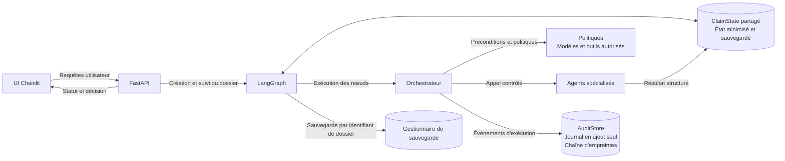
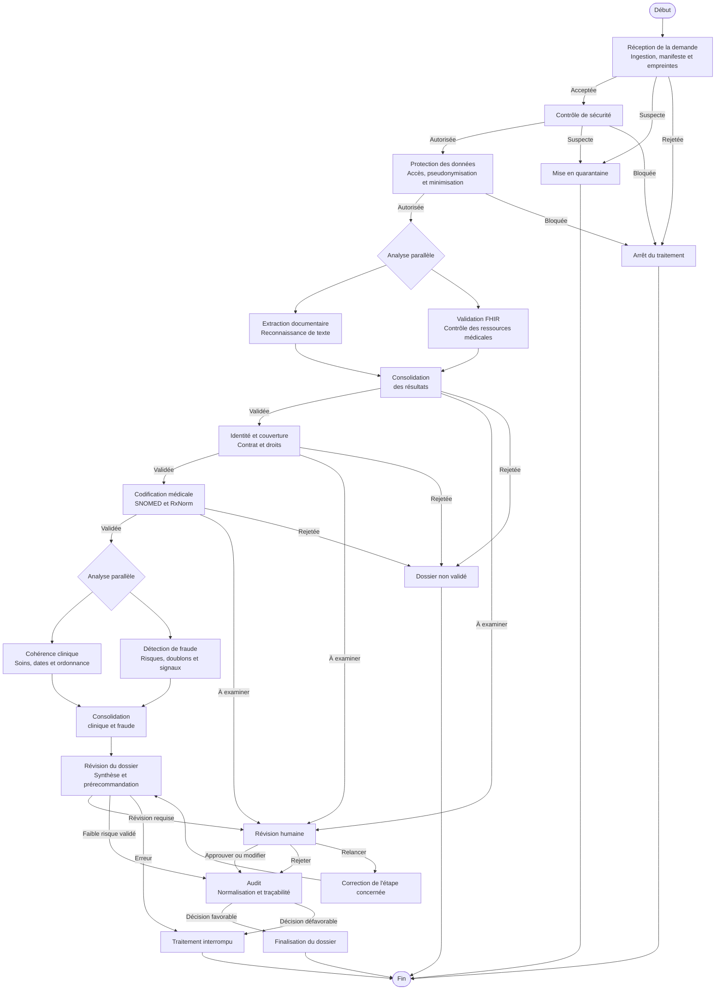

# Diagrammes du projet

## Architecture système

```mermaid
flowchart LR
    UI["UI Chainlit"] -->|Requêtes utilisateur| API["FastAPI"]

    API -->|Création et suivi du dossier| GRAPH["LangGraph"]
    GRAPH <--> STATE[("ClaimState partagé<br/>État minimisé et sauvegardé")]
    GRAPH -->|Exécution des nœuds| ORCH["Orchestrateur"]

    ORCH -->|Préconditions et politiques| POLICY["Politiques<br/>Modèles et outils autorisés"]
    ORCH -->|Appel contrôlé| AGENTS["Agents spécialisés"]
    AGENTS -->|Résultat structuré| STATE

    ORCH -->|Événements d'exécution| AUDIT[("AuditStore<br/>Journal en ajout seul<br/>Chaîne d'empreintes")]
    GRAPH -->|Sauvegarde par identifiant de dossier| CHECKPOINT[("Gestionnaire de sauvegarde")]

    API -->|Statut et décision| UI
```

## Workflow métier

```mermaid
flowchart TD
    DEBUT(["Début"]) --> INTAKE["Réception de la demande<br/>Ingestion, manifeste et empreintes"]

    INTAKE -->|Acceptée| SECURITY["Contrôle de sécurité"]
    INTAKE -->|Suspecte| QUARANTINE["Mise en quarantaine"]
    INTAKE -->|Rejetée| ECHEC1["Arrêt du traitement"]

    SECURITY -->|Autorisée| PRIVACY["Protection des données<br/>Accès, pseudonymisation et minimisation"]
    SECURITY -->|Suspecte| QUARANTINE
    SECURITY -->|Bloquée| ECHEC1

    PRIVACY -->|Autorisée| PARALLELE1{"Analyse parallèle"}
    PRIVACY -->|Bloquée| ECHEC1

    PARALLELE1 --> OCR["Extraction documentaire<br/>Reconnaissance de texte"]
    PARALLELE1 --> FHIR["Validation FHIR<br/>Contrôle des ressources médicales"]

    OCR --> FUSION1["Consolidation<br/>des résultats"]
    FHIR --> FUSION1

    FUSION1 -->|Validée| IDENTITY["Identité et couverture<br/>Contrat et droits"]
    FUSION1 -->|À examiner| HUMAN["Révision humaine"]
    FUSION1 -->|Rejetée| ECHEC2["Dossier non validé"]

    IDENTITY -->|Validée| CODING["Codification médicale<br/>SNOMED et RxNorm"]
    IDENTITY -->|À examiner| HUMAN
    IDENTITY -->|Rejetée| ECHEC2

    CODING -->|Validée| PARALLELE2{"Analyse parallèle"}
    CODING -->|À examiner| HUMAN
    CODING -->|Rejetée| ECHEC2

    PARALLELE2 --> CLINICAL["Cohérence clinique<br/>Soins, dates et ordonnance"]
    PARALLELE2 --> FRAUD["Détection de fraude<br/>Risques, doublons et signaux"]

    CLINICAL --> FUSION2["Consolidation<br/>clinique et fraude"]
    FRAUD --> FUSION2

    FUSION2 --> REVIEWER["Révision du dossier<br/>Synthèse et prérecommandation"]

    REVIEWER -->|Révision requise| HUMAN
    REVIEWER -->|Faible risque validé| AUDIT["Audit<br/>Normalisation et traçabilité"]
    REVIEWER -->|Erreur| ECHEC3["Traitement interrompu"]

    HUMAN -->|Approuver ou modifier| AUDIT
    HUMAN -->|Rejeter| AUDIT
    HUMAN -->|Relancer| CORRECTION["Correction de l'étape concernée"]
    CORRECTION --> REVIEWER

    AUDIT -->|Décision favorable| FINALIZE["Finalisation du dossier"]
    AUDIT -->|Décision défavorable| ECHEC3

    FINALIZE --> FIN(["Fin"])
    QUARANTINE --> FIN
    ECHEC1 --> FIN
    ECHEC2 --> FIN
    ECHEC3 --> FIN
```
