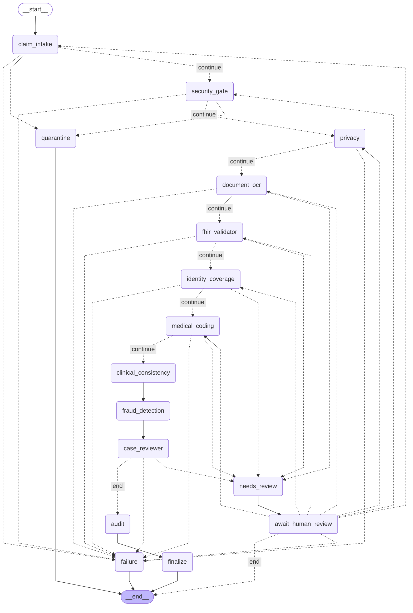

# Représentation Mermaid du workflow — graph/workflow.py

Exemple généré via `graph.workflow.get_workflow_mermaid()`, qui appelle
`CompiledStateGraph.get_graph().draw_mermaid()` sur un workflow compilé avec
`interrupt_before=[]` et les agents futurs (`clinical_consistency`,
`fraud_detection`, `case_reviewer`, `audit`) en stub par défaut.

Aucune donnée sensible : uniquement des noms de nœuds et de routes
(`continue`, `end`, etc.), jamais de contenu de dossier, de secret ou de
donnée patient.

## Régénérer cet exemple

```python
from graph.workflow import get_workflow_mermaid

print(get_workflow_mermaid())
```

## Exemple



## Lecture rapide

- Les flèches en pointillés (`-.->`) sont des arêtes conditionnelles (routage
  selon le résultat d'un agent) ; les flèches pleines (`-->`) sont des arêtes
  normales.
- `await_human_review` pointe vers les 7 nœuds agents amont
  (`RELAUNCH_TARGETS`, dans `graph/edges.py`) : c'est la route de relance
  (« relancer ») déclenchée par une décision humaine `NEEDS_MORE_INFO`.
- Tout chemin se termine par `__end__`, directement ou via `failure`.
